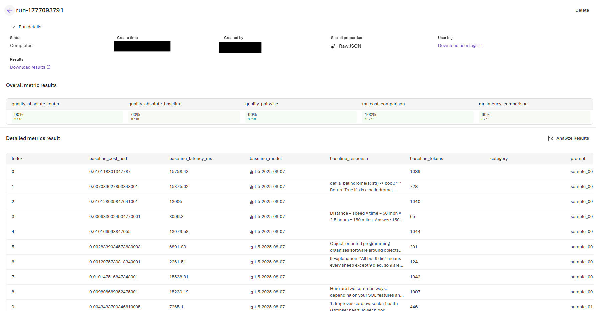

# Foundry Cloud Evaluation Report

**Generated:** 2026-04-25 05:11 UTC
**Eval ID:** `eval_REDACTED`
**Run ID:** `evalrun_REDACTED`
**Status:** completed
**Portal:** `https://ai.azure.com/build/evaluations/<eval-id>/run/<run-id>` (link redacted; the live portal URL is generated when you run your own evaluation)

---

## Grader Results

| Grader | Mean Score | Pass Rate | Samples |
|--------|-----------|-----------|---------|
| mr_cost_comparison | 0.953 | 100.0% | 10 |
| mr_latency_comparison | 0.498 | 60.0% | 10 |
| quality_absolute_baseline | 3.200 | 60.0% | 10 |
| quality_absolute_router | 4.400 | 90.0% | 10 |
| quality_pairwise | 3.900 | 90.0% | 10 |

## Result Counts

- **errored:** 0
- **failed:** 6
- **passed:** 4
- **total:** 10

---
*Report generated by Foundry Evaluation SDK integration*
