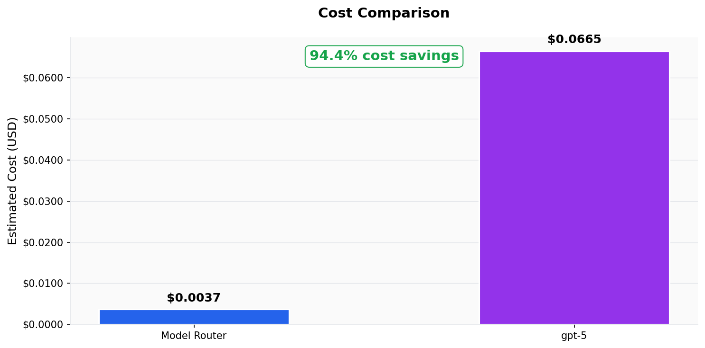
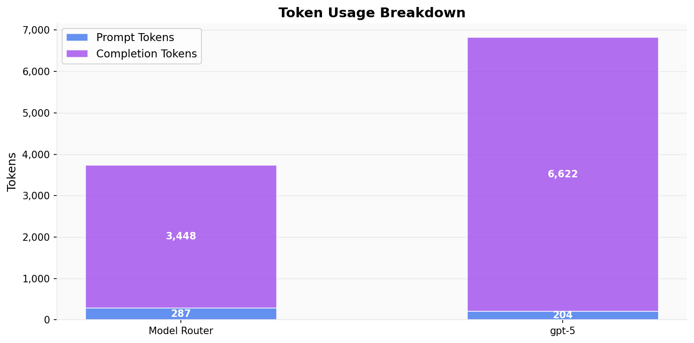
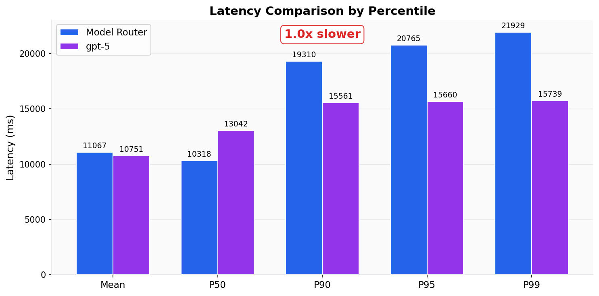
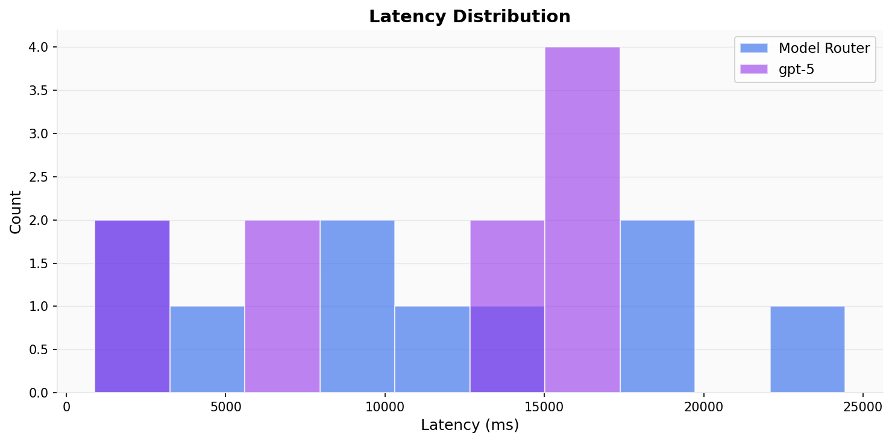
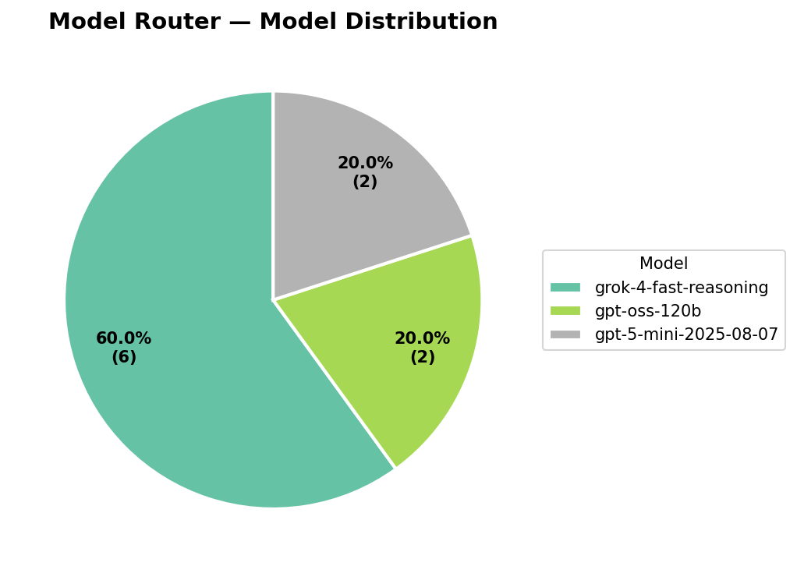
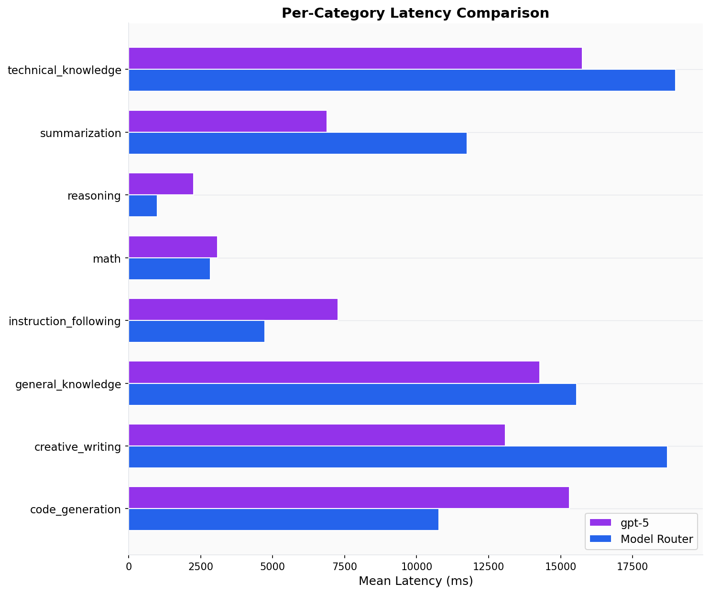
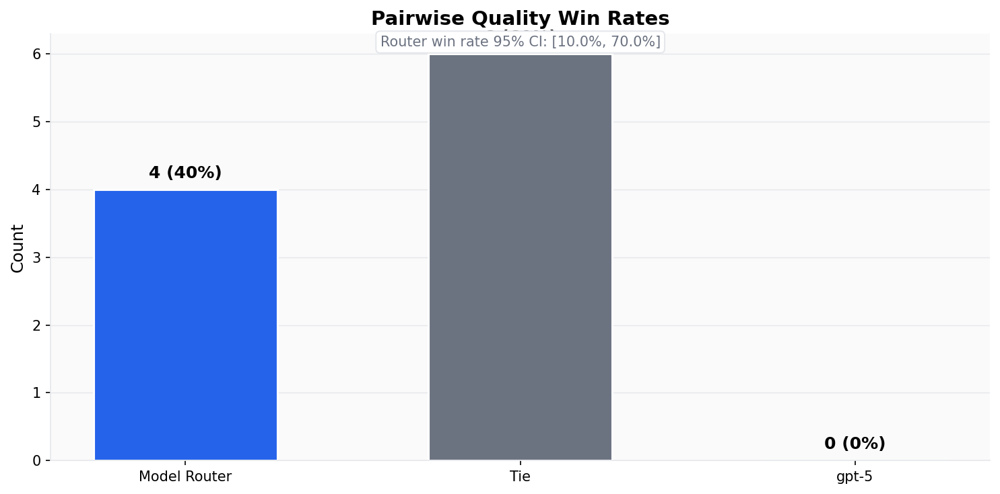
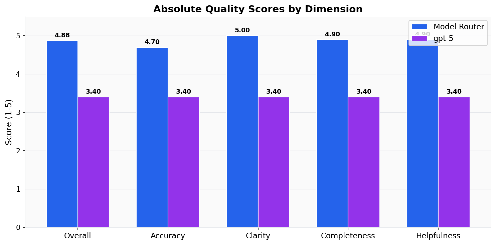

# Evaluation Report: model-router-vs-gpt5

## Executive Summary

Model Router was evaluated against **gpt-5** on 10 prompts. Model Router achieved **+94.4% cost savings** and was **1.0x slower** on average (mean latency). Quality evaluation: Model Router won **40%** of pairwise comparisons (4W / 0L / 6T).

---

## Cost Analysis

| Metric | Model Router | Baseline |
|--------|-------------|----------|
| Total tokens | 3,735 | 6,826 |
| Prompt tokens | 287 | 204 |
| Completion tokens | 3,448 | 6,622 |
| Estimated cost | $0.0037 | $0.0665 |
| Cost per prompt (avg) | $0.000370 | $0.006647 |
| Cost per prompt (p50) | $0.000137 | $0.008500 |
| Cost per prompt (p95) | $0.001256 | $0.010264 |

**Cost savings: +94.4%**

---

## Latency Analysis

| Metric | Model Router | Baseline |
|--------|-------------|----------|
| Mean | 11067ms | 10751ms |
| Median (p50) | 10318ms | 13042ms |
| p90 | 19310ms | 15561ms |
| p95 | 20765ms | 15660ms |
| p99 | 21929ms | 15739ms |

**Model Router is 1.0x slower (mean)**

---

## Model Router — Model Distribution

The model router selected the following underlying models:

| Model | Requests | Share |
|-------|----------|-------|
| grok-4-fast-reasoning | 6 | 60.0% |
| gpt-oss-120b | 2 | 20.0% |
| gpt-5-mini-2025-08-07 | 2 | 20.0% |

---

## Per-Category Latency (Mean)

| Category | Model Router | Baseline |
|----------|-------------|----------|
| code_generation | 10776ms | 15307ms |
| creative_writing | 18711ms | 13080ms |
| general_knowledge | 15550ms | 14272ms |
| instruction_following | 4730ms | 7265ms |
| math | 2837ms | 3096ms |
| reasoning | 994ms | 2262ms |
| summarization | 11756ms | 6892ms |
| technical_knowledge | 18987ms | 15758ms |

---

## Quality Evaluation (LLM-as-a-Judge)

### Pairwise Win Rates

| Outcome | Count | Rate |
|---------|-------|------|
| Model Router wins | 4 | 40.0% |
| Baseline wins | 0 | 0.0% |
| Ties | 6 | 60.0% |
| **Total judged** | **10** | |

Router win rate 95% CI: [10.0%, 70.0%]

### Absolute Quality Scores (1-5 scale)

| Dimension | Model Router | Baseline |
|-----------|-------------|----------|
| **Overall** | **4.88** | **3.40** |
| Accuracy | 4.70 | 3.40 |
| Clarity | 5.00 | 3.40 |
| Completeness | 4.90 | 3.40 |
| Helpfulness | 4.90 | 3.40 |

### Per-Category Win Rates

| Category | Router Win | Baseline Win | Tie | Count |
|----------|-----------|-------------|-----|-------|
| code_generation | 0.0% | 0.0% | 100.0% | 2 |
| creative_writing | 100.0% | 0.0% | 0.0% | 1 |
| general_knowledge | 100.0% | 0.0% | 0.0% | 2 |
| instruction_following | 0.0% | 0.0% | 100.0% | 1 |
| math | 0.0% | 0.0% | 100.0% | 1 |
| reasoning | 0.0% | 0.0% | 100.0% | 1 |
| summarization | 0.0% | 0.0% | 100.0% | 1 |
| technical_knowledge | 100.0% | 0.0% | 0.0% | 1 |

### Composite Scores

| Metric | Model Router | Baseline |
|--------|-------------|----------|
| Quality / Cost (higher = better) | 1316.1 | 51.1 |
| Quality / Latency (higher = better) | 0.4 | 0.3 |

---

## Reliability

| Metric | Model Router | Baseline |
|--------|-------------|----------|
| Total requests | 10 | 10 |
| Successful | 10 | 10 |
| Errors | 0 | 0 |
| Timeouts | 0 | 0 |

---

## Methodology

- **Dataset**: datasets/sample_custom.jsonl
- **Sample size**: 10 prompts
- **Model Router endpoint**: model-router
- **Baseline model**: gpt-5
- **Temperature**: 0.7
- **Max tokens**: 1024
- **Concurrency**: 5 parallel requests

Prompts were sent sequentially to each endpoint per-prompt (router then baseline) to ensure fair latency comparison. Concurrency was applied across prompts.