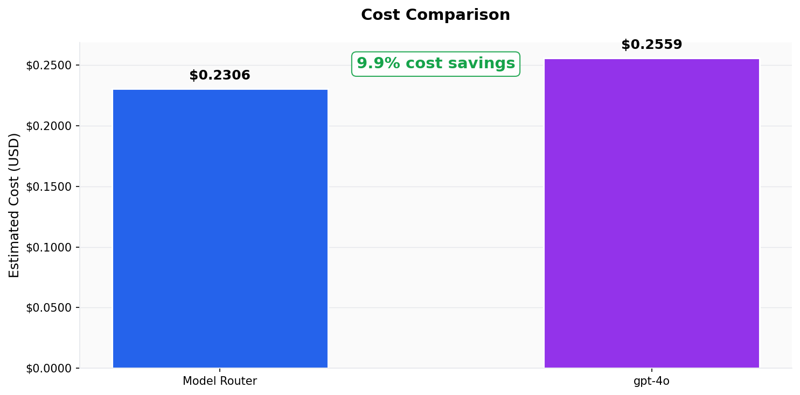
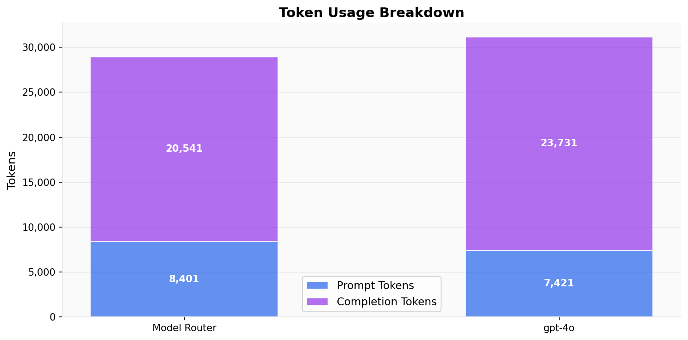
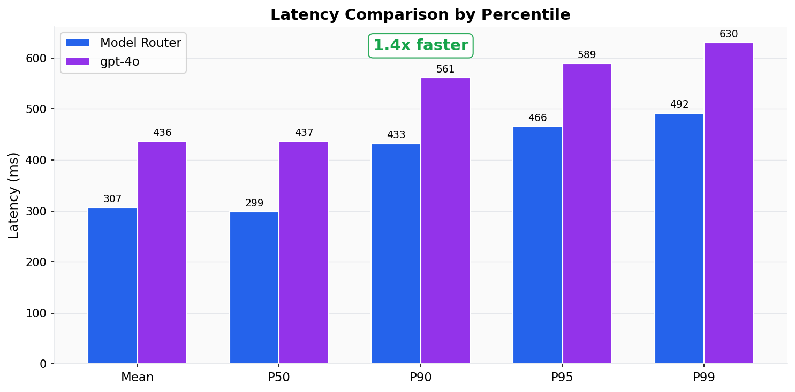
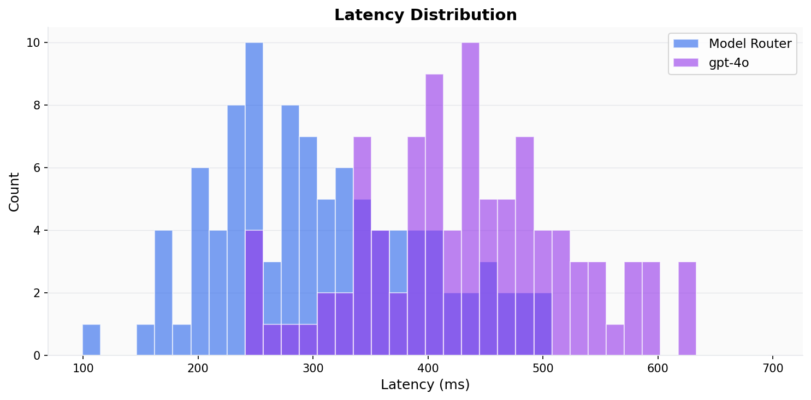
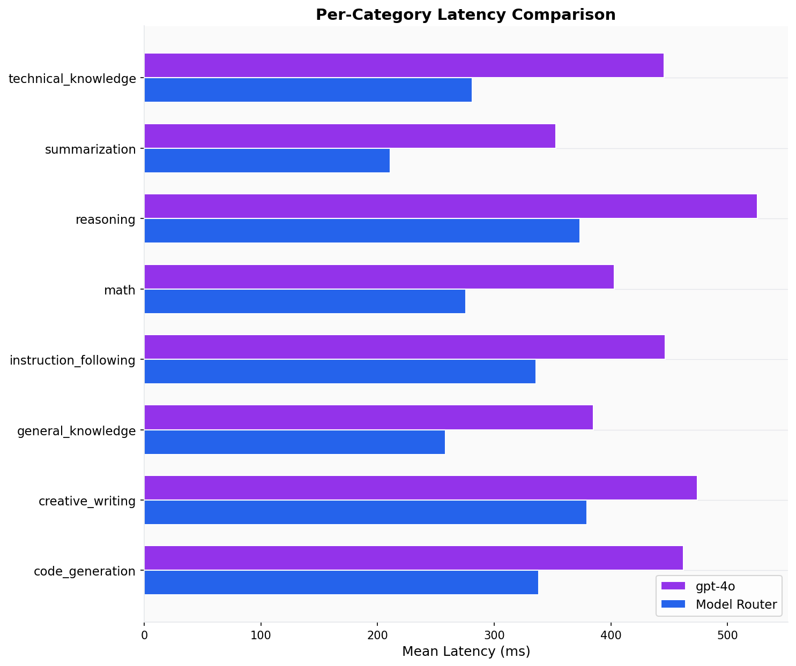
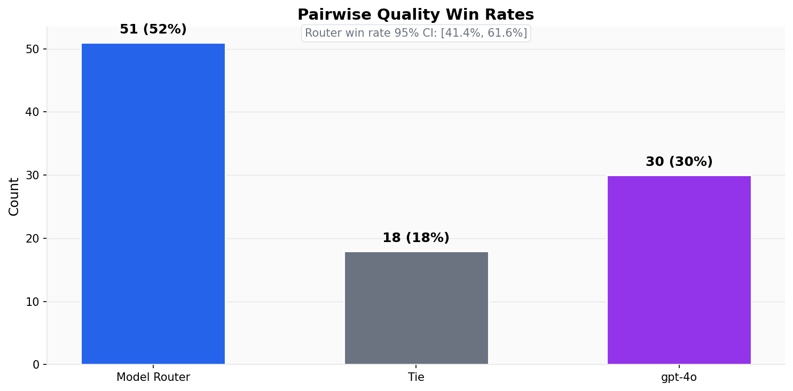
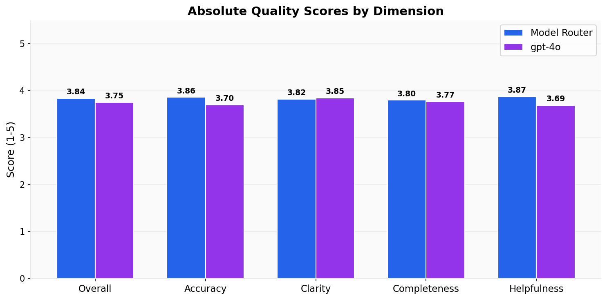

# Evaluation Report: sample-demo-report

## Executive Summary

Model Router was evaluated against **gpt-4o** on 100 prompts. Model Router achieved **+9.9% cost savings** and was **1.4x faster** on average (mean latency). Quality evaluation: Model Router won **52%** of pairwise comparisons (51W / 30L / 18T).

---

## Cost Analysis

| Metric | Model Router | Baseline |
|--------|-------------|----------|
| Total tokens | 28,942 | 31,152 |
| Prompt tokens | 8,401 | 7,421 |
| Completion tokens | 20,541 | 23,731 |
| Estimated cost | $0.2306 | $0.2559 |
| Cost per prompt (avg) | $0.002353 | $0.002693 |
| Cost per prompt (p50) | $0.002381 | $0.002675 |
| Cost per prompt (p95) | $0.003706 | $0.004205 |

**Cost savings: +9.9%**

---

## Latency Analysis

| Metric | Model Router | Baseline |
|--------|-------------|----------|
| Mean | 307ms | 436ms |
| Median (p50) | 299ms | 437ms |
| p90 | 433ms | 561ms |
| p95 | 466ms | 589ms |
| p99 | 492ms | 630ms |

**Model Router is 1.4x faster (mean)**

---

## Per-Category Latency (Mean)

| Category | Model Router | Baseline |
|----------|-------------|----------|
| code_generation | 338ms | 462ms |
| creative_writing | 379ms | 474ms |
| general_knowledge | 258ms | 385ms |
| instruction_following | 336ms | 446ms |
| math | 276ms | 403ms |
| reasoning | 374ms | 525ms |
| summarization | 211ms | 353ms |
| technical_knowledge | 281ms | 446ms |

---

## Quality Evaluation (LLM-as-a-Judge)

### Pairwise Win Rates

| Outcome | Count | Rate |
|---------|-------|------|
| Model Router wins | 51 | 51.5% |
| Baseline wins | 30 | 30.3% |
| Ties | 18 | 18.2% |
| **Total judged** | **99** | |

Router win rate 95% CI: [41.4%, 61.6%]

### Absolute Quality Scores (1-5 scale)

| Dimension | Model Router | Baseline |
|-----------|-------------|----------|
| **Overall** | **3.84** | **3.75** |
| Accuracy | 3.86 | 3.70 |
| Clarity | 3.82 | 3.85 |
| Completeness | 3.80 | 3.77 |
| Helpfulness | 3.87 | 3.69 |

### Per-Category Win Rates

| Category | Router Win | Baseline Win | Tie | Count |
|----------|-----------|-------------|-----|-------|
| code_generation | 33.3% | 41.7% | 25.0% | 12 |
| creative_writing | 61.5% | 30.8% | 7.7% | 13 |
| general_knowledge | 58.3% | 33.3% | 8.3% | 12 |
| instruction_following | 50.0% | 16.7% | 33.3% | 12 |
| math | 61.5% | 15.4% | 23.1% | 13 |
| reasoning | 25.0% | 58.3% | 16.7% | 12 |
| summarization | 58.3% | 8.3% | 33.3% | 12 |
| technical_knowledge | 61.5% | 38.5% | 0.0% | 13 |

### Composite Scores

| Metric | Model Router | Baseline |
|--------|-------------|----------|
| Quality / Cost (higher = better) | 16.6 | 14.7 |
| Quality / Latency (higher = better) | 12.5 | 8.6 |

---

## Reliability

| Metric | Model Router | Baseline |
|--------|-------------|----------|
| Total requests | 100 | 100 |
| Successful | 98 | 95 |
| Errors | 2 | 5 |
| Timeouts | 0 | 0 |

---

## Methodology

- **Dataset**: datasets/mock_100_prompts.jsonl
- **Sample size**: 100 prompts
- **Model Router endpoint**: model-router
- **Baseline model**: gpt-4o
- **Temperature**: 0.7
- **Max tokens**: 1024
- **Concurrency**: 5 parallel requests

Prompts were sent sequentially to each endpoint per-prompt (router then baseline) to ensure fair latency comparison. Concurrency was applied across prompts.